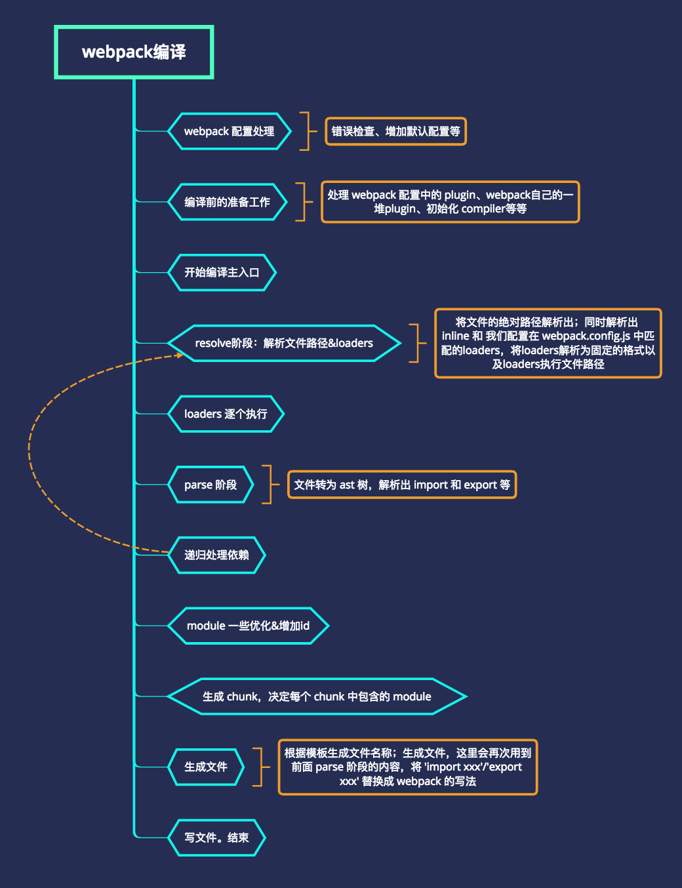
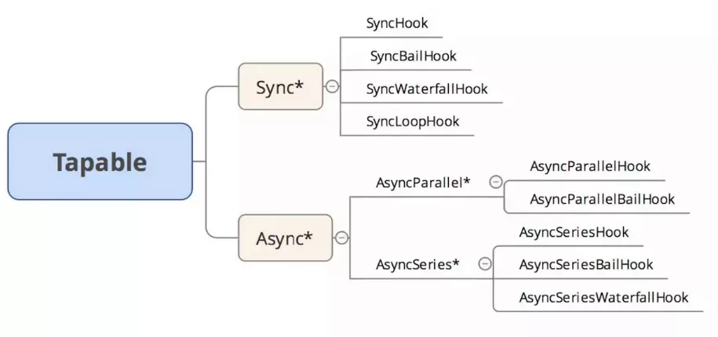

# webpack 

## webpack的编译主流程

流程图



## 插件
Webpack 通过 Plugin 机制让其更加灵活，以适应各种应用场景。 在 Webpack 运行的生命周期中会广播出许多事件，Plugin 可以监听这些事件，在合适的时机通过 Webpack 提供的 API 改变输出结果。

- Plugin的编写原则 
  + 构造函数
  + apply方法
  + 挂在哪个生命周期上，调用方式
  + 监听事件

- 定义插件
```
class BasicPlugin{
  // 在构造函数中获取用户给该插件传入的配置
  constructor(options){

  }

  // Webpack 会调用 BasicPlugin 实例的 apply 方法给插件实例传入 compiler 对象
  apply(compiler){
    const onEmit = (compilation, callback) => {
      callback()
    }
    // 检测是否是webpack4
    if (compiler.hooks) {
      // 注册emit事件的监听函数 webpack4
      compiler.hooks.emit.tapAsync(this.constructor.name, onEmit)
    } else {
      // 注册emit事件的监听函数 webpack3及之前
      compiler.plugin('emit', onEmit)
    }
  }
}
// 导出 Plugin
module.exports = BasicPlugin;
```
- 使用插件
 + 实例化插件
 + 调用插件的apply方法
 + 在定义的钩子上以约定的方式调用 

```
const BasicPlugin = require('./BasicPlugin.js');
module.export = {
  plugins:[
    new BasicPlugin(options),
  ]
}
```
### Compiler 和 Compilation

在开发 Plugin 时最常用的两个对象就是 `Compiler`和 `Compilation`，它们是 Plugin 和 Webpack 之间的桥梁。 

#### Compiler

Compiler 对象包含了 Webpack 环境所有的的配置信息，包含 options，loaders，plugins 这些信息，这个对象在 Webpack 启动时候被实例化，它是全局唯一的，可以简单地把它理解为 Webpack 实例；

#### Compilation
Compilation 对象包含了当前的模块资源、编译生成资源、变化的文件等。当 Webpack 以开发模式运行时，每当检测到一个文件变化，一次新的 Compilation 将被创建。Compilation 对象也提供了很多事件回调供插件做扩展。通过 Compilation 也能读取到 Compiler 对象。

区别: 
- Compiler 代表了整个 Webpack 从启动到关闭的生命周期
- Compilation 只是代表了一次新的编译。

## 事件流
Webpack 就像一条生产线，要经过一系列处理流程后才能将源文件转换成输出结果。 这条生产线上的每个处理流程的职责都是单一的，多个流程之间有存在依赖关系，只有完成当前处理后才能交给下一个流程去处理。 插件就像是一个插入到生产线中的一个功能，在特定的时机对生产线上的资源做处理。

Webpack 通过 `Tapable` 来组织这条复杂的生产线。 Webpack 在运行过程中会广播事件，插件只需要监听它所关心的事件，就能加入到这条生产线中，去改变生产线的运作。 Webpack 的事件流机制保证了插件的有序性，使得整个系统扩展性很好。

Tapable提供了很多类型的hook，分为`同步`和`异步`两大类(异步中又区分`异步并行`和`异步串行`)，而根据事件执行的终止条件的不同，由衍生出 `Bail/Waterfall/Loop` 类型。



- BasicHook: 执行每一个，不关心函数的返回值，有 SyncHook、AsyncParallelHook、AsyncSeriesHook。

- BailHook: 顺序执行 Hook，遇到第一个结果 result !== undefined 则返回，不再继续执行。有：SyncBailHook、AsyncSeriseBailHook, AsyncParallelBailHook。

- WaterfallHook: 类似于 reduce，如果前一个 Hook 函数的结果 result !== undefined，则 result 会作为后一个 Hook 函数的第一个参数。既然是顺序执行，那么就只有 Sync 和 AsyncSeries 类中提供这个Hook：SyncWaterfallHook，AsyncSeriesWaterfallHook

- LoopHook: 不停的循环执行 Hook，直到所有函数结果 result === undefined。同样的，由于对串行性有依赖，所以只有 SyncLoopHook 和 AsyncSeriseLoopHook （PS：暂时没看到具体使用 Case）

Webpack 的事件流机制应用了发布/订阅模式，和 Node.js 中的 EventEmitter 非常相似。 Compiler 和 Compilation 都继承自 Tapable，可以直接在 Compiler 和 Compilation 对象上广播和监听事件，方法如下

### 关键的事件节点：

- `entryOption` 
 SyncBailHook 在 entry 配置项处理过之后，执行插件。

- `afterPlugins`
 SyncHook 设置完初始插件之后，执行插件。
 参数：compiler

- `afterResolvers`
SyncHook

resolver 安装完成之后，执行插件。

参数：compiler

- `environment`
 SyncHook

 environment 准备好之后，执行插件。
- `afterEnvironment`
  SyncHook
  environment 安装完成之后，执行插件。

- `beforeRun`
  AsyncSeriesHook
  compiler.run() 执行之前，添加一个钩子。
  参数：compiler
- `run`
  AsyncSeriesHook
  开始读取 records 之前，钩入(hook into) compiler。

  参数：compiler

- watchRun
  AsyncSeriesHook

  监听模式下，一个新的编译(compilation)触发之后，执行一个插件，但是是在实际编译开始之前。

  参数：compiler

- `normalModuleFactory`
  SyncHook
  NormalModuleFactory 创建之后，执行插件。

  参数：normalModuleFactory

- `contextModuleFactory`
  ContextModuleFactory 创建之后，执行插件。

  参数：contextModuleFactory

- `beforeCompile`
  AsyncSeriesHook

  编译(compilation)参数创建之后，执行插件。

  参数：compilationParams

- `compile`
  SyncHook

  一个新的编译(compilation)创建之后，钩入(hook into) compiler。

  参数：compilationParams

- `thisCompilation`
  SyncHook

  触发 compilation 事件之前执行（查看下面的 compilation）。

  参数：compilation

- `compilation`
  SyncHook

  编译(compilation)创建之后，执行插件。

  参数：compilation

- `make`
  AsyncParallelHook

  参数：compilation

- `afterCompile`
  AsyncSeriesHook

  参数：compilation

- `shouldEmit`
  SyncBailHook

  此时返回 true/false。

  参数：compilation

- `needAdditionalPass`
  SyncBailHook

  ...

- `emit`
  AsyncSeriesHook

  生成资源到 output 目录之前。

  参数：compilation

- `afterEmit`
  AsyncSeriesHook

  生成资源到 output 目录之后。

  参数：compilation

- `done`
  SyncHook

  编译(compilation)完成。

  参数：stats

- `failed`
  SyncHook

  编译(compilation)失败。

  参数：error

- `invalid`
  SyncHook

  监听模式下，编译无效时。

  参数：fileName, changeTime

- `watchClose`
  SyncHook

  监听模式停止。

